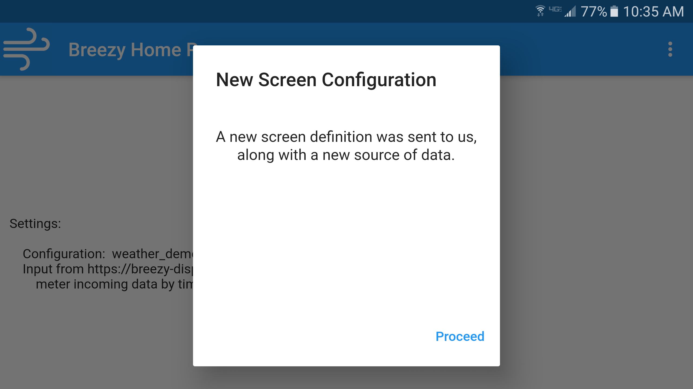
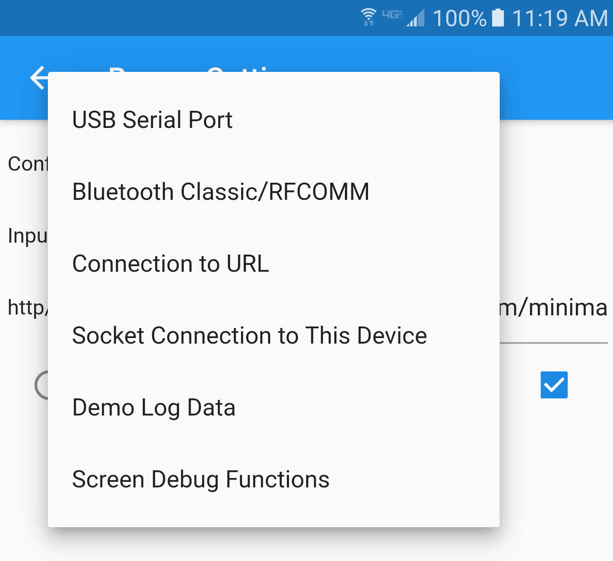

# Breezy Ventilator Display
Display program for embedded controllers, like the Breezy emergency ventilator.

The main program in this directory is an Android/Flutter application that
gathers data from an embedded device, and displays it in graphical and numeric
form.  It is used for the Breezy Ventilator, but can be configured to display
time-based data from any source.  Data can be sent over a USB serial cable,
Bluetooth/RFCOMM, an outgoing socket, or an incoming socket.  A straightforward
JSON file can be sent from the device (or anywhere else) to configure the
appearance of the screen(s) and the nature of the data feed.

No provision is made for control of the device.  For a ventilator this is
inappropriate, because interacting with
a capacitive screen while wearing gloves is impractical.

This code and app are offered under the [MIT License](LICENSE), which allows it to
be used freely, but includes a strong liability disclaimer.


## Platforms

This application targets all Android platforms on which Flutter is supported.
As of this writing, it has not been tried on iOS, but it should be possible
to build it there.  All of the libraries it uses support iOS, with the
exception of the bluetooth libraries.  For the iPhone, the application should
build and run, but this has not been tested.  Bluetooth support would require
more work.

Flutter is available on Android devices
"armeabi-v7a (ARM 32-bit), arm64-v8a (ARM 64-bit), and x86-64 (x86 64-bit)."  Alas,
"Flutter does not currently support building for x86 Android." - see 
https://flutter.dev/docs/deployment/android#what-are-the-supported-target-architectures.

## Configuring the Display

The display and data feed can be configured with a straightforward file
in a JSON syntax.  This is described in detail in
[__the configuration document__](breezy/docs/configure.md).

<center>

</center>

## Data Sources and Connecting to the Device



Breezy-Display supports communication via USB/Serial Port, Bluetooth/RFCOMM,
an outgoing socket to a URL, or an incoming socket.  Once connected, there's
a simple text protocol for sending data, and a small number of commands
that the device can send to the display.  Details are available in 
[__the protocol and commands document__](breezy/docs/protocol-and-commands.md).


## Building

Development is being done on Android Studio.  That's a big download and a lot of
installation, though.  It should be possible to deploy and run if you have the
Android SDK, and the [Flutter SDK](https://flutter.dev/docs/development/tools/sdk/releases).
If there are problems, `flutter doctor` might be helpful.

### Commands used to build/deploy
```
flutter clean
flutter build appbundle
```
makes a build for the Play Store.  Alternately,
```
flutter clean
flutter build apk --split-per-abi
```
makes APKs suitable for github.

## Documentation Index

* [__Configuration__](breezy/docs/configure.md)
* [__Protocol and Commands__](breezy/docs/protocol-and-commands.md)
