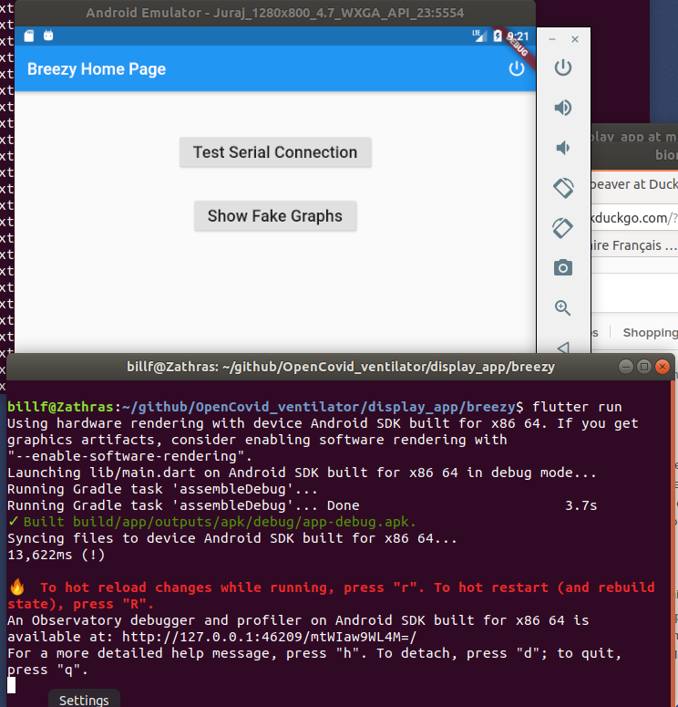

# Breezy Ventilator Display
Display program for the Breezy emergency ventilator.

The main program in this directory is an Android/Flutter application that
gathers data from the ventilator, and displays it in graphical and numeric
form.  Control of the ventilator is not envisaged, because interacting with
a capacitive screen while wearing gloves is impractical.

This code is offered under the [MIT License](LICENSE), which allows it to
be used freely, but includes a strong liability disclaimer.

Once you've
installed the app, and presumably switched the serial cable to the device under test, you
should be able to run it.  The power button in the upper-right hand corner of the display
screen does an `exit(0)` system call, which kills the process and should clean everything up.

## Platforrms

This application targets all Android platforms on which Flutter is supported.
As of this writing, all of the libraries support iOS as well, so it should work
on iPhone, but this has not been tested.  Flutter is available on Android devices
"armeabi-v7a (ARM 32-bit), arm64-v8a (ARM 64-bit), and x86-64 (x86 64-bit).  
Flutter does not currently support building for x86 Android." - see 
https://flutter.dev/docs/deployment/android#what-are-the-supported-target-architectures.

## Building

Development is being done on Android Studio.  That's a big download and a lot of
installation, though.  It should be possible to deploy and run if you have the
Android SDK, and the [Flutter SDK](https://flutter.dev/docs/development/tools/sdk/releases).
If there are problems, `flutter doctor` might be helpful.  If everything works, it should
look like this:


### Installation of a Debug Build - if bundletool works

This application uses Flutter, which has a significant native (non-Java)
component.  Instead of an APK, applications are distributed as an "aab" file.
A tool called "bundletool" is used to generate apks, and then used again
to select the correct apk for a connected device.  So to install a debug
build, the first step is to go over to https://github.com/google/bundletool/,
and get the latest release of the bundletool jar.  As of this writing, that's
`bundletool-all-0.13.3.jar`.  Then, make up a little shell script or whatever to run
it.  Personally, I put the jar in `~/lib`, and I made a shell script like this in my
`~/bin`:
```bash
#!/bin/bash
JAR=$HOME/lib/bundletool-all-0.13.3.jar
echo "Running $JAR"
echo "cf. https://github.com/google/bundletool/"
java -jar $JAR "$@"
```
On my side, I'll build `app-release.abb` with the command `flutter build appbundle`, and I'll
generate the (huge) `.apks` file, which I'll call `breezy.apks`.  (Note to self:  that's done with
`bundletool build-apks --bundle=app-release.aab --output=breezy.apks`).  I have to do this step, because
it signs the underlying apk files with a debug key.  To install the app, download `breezy.apks`,
and do this:
```ignorelang
bundletool install-apks --apks=~/tmp/tmp/breezy.apks
```
If there are  multiple devices connected, it will tell you to use `--device-id`.  

### Installation of a debug build - if bundletool does not work

A more manual way of doing this that was found to work is as follows.  The `.apks` file reference
above is really just a zip file that contains a bunch of APK files.  So what has been found to
work is:
```ignorelang
billf@Zathras:~/tmp/tmp$ unzip breezy.apks
<... lots of output ...>
billf@Zathras:~/tmp/tmp$ mv standalones/standalone-armeabi_v7a_hdpi.apk breezy.apk
billf@Zathras:~/tmp/tmp$ adb install breezy.apk
```
The `.apk` files in the `.apks` archive are already signed.  Depending on hardware, a different
standalone apk might be appropriate.
